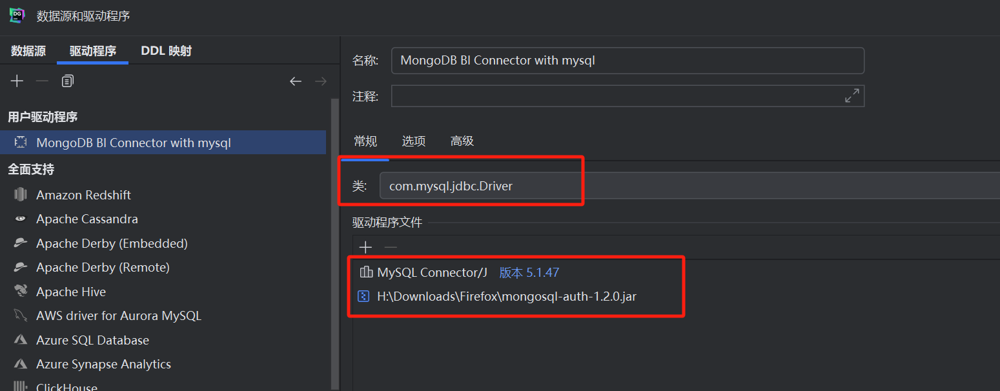

# BIConnector-examples

## 示例如何使用JDBC连接MongoDB的BI Connector工具

### 运行 BI Connector

通过BI Connector工具，可以通过MySQL JDBC的方式对MongoDB中的数据进行查询，参考官方文档：[BI Connector 概述](https://www.mongodb.com/zh-cn/docs/bi-connector/current/)

系统使用win11 x64, 下载[安装包](https://www.mongodb.com/try/download/bi-connector)

安装完成后进行启动，使用自己的`config`配置文件`mongosqld.conf`(需要修改其中的用户名密码配置)。

启动命令：

当前目录为`Conenector for BI`安装目录的根目录中，`mongosqld.conf`文件也放在这一位置，命令行工具为powershell7

```powershell
 & '.\bin\mongosqld.exe' --config mongosqld.conf
```

### 通过JDBC进行连接

maven:

```xml
<dependency>
    <groupId>org.mongodb</groupId>
    <artifactId>mongosql-auth</artifactId>
    <version>1.2.0</version>
</dependency>

<dependency>
   <groupId>mysql</groupId>
   <artifactId>mysql-connector-java</artifactId>
   <version>5.1.47</version>
</dependency>
```

连接字符串：

jdbc:mysql://127.0.0.1:3307?useSSL=false&authenticationPlugins=org.mongodb.mongosql.auth.plugin.MongoSqlAuthenticationPlugin

- 这个3307来自于配置文件mongosqld.conf中的配置
- mysql的驱动需要在5.1.39-5.1.x之间，不能小于5.1.39，也不能使用8.x等较新的版本

### 通过DataGrip进行连接



需要自行创建一个驱动程序，并使用包含 MySQL Connector/J 的 MongoSQL 身份验证插件的包。其他的配置和mysql类似。

### 使用

#### 刷新schema：

可以通过配置`mongosqld.conf`中的`refreshIntervalSecs`参数（重新采样刷新间隔/秒）来定时刷新，也可以通过sql命令`FLUSH SAMPLE`来刷新，使用该命令时使用的mongo用户需要有`insert`和`update`权限。

```SQL
FLUSH SAMPLE
```
